# 📝 독스루 (DocThru) - BE

[Docthru API 문서 바로가기](https://docthru-be-wstf.onrender.com/api-docs/)

## 📌 프로젝트 소개

**DocThru**는 기술 문서 번역을 통해 개발자들이 함께 성장할 수 있도록 도와주는
**챌린지 기반 협업 번역 플랫폼**입니다.

- 사용자는 번역하고 싶은 기술 문서의 원문 링크와 함께, 마감일 및 최대 참여 인원
  을 설정하여 번역 챌린지를 생성(신청)할 수 있습니다.
- 관리자는 번역 챌린지를 **승인/거절**하거나, 사용자의 번역물을 **목록 및 상세조
  회**할 수 있습니다.
- 지정된 챌린지 문서를 **웹 기반 에디터**에서 번역하고, 다른 사용자로부터 피드백
  과 추천(좋아요)을 받을 수 있습니다.
- 일반 사용자는 번역물을 10회 제출하거나, 또는 번역물 5회 제출 + 5회 이상 추천을
  받을 경우, 전문가로 승급됩니다.

- ## 🗓️ 개발 기간

**2025년 3월 24일 (월) ~ 4월 16일 (화)**  
총 약 3주간 진행

## 👨‍👩‍👧‍👦 팀원 정보

| 이름                                       | 백엔드 주요 담당 역할                            |
| ------------------------------------------ | ------------------------------------------------ |
| [이동혁](https://github.com/hyuk-dev)      | DB 모델링, 챌린지, 관리자 API                    |
| [최은비](https://github.com/silverraining) | DB 모델링, 작업물, 임시저장, 알림 API            |
| [김승우](https://github.com/stevenkim18)   | DB 모델링, 인증/인가, 관리자, 피드백, 좋아요 API |

### Backend


### Database


### Validation & API Docs


### 배포


## 프로젝트 구조

<details>
  <summary>파일 트리 보기</summary>

```
📦 src
┣ 📂application
┣ 📂domains
┃ ┣ 📂auth
┃ ┃ ┣ 📜auth.controller.ts
┃ ┃ ┣ 📜auth.routes.ts
┃ ┃ ┣ 📜auth.service.ts
┃ ┃ ┗ 📜auth.types.ts
┃ ┣ 📂challenges
┃ ┃ ┣ 📜challenges.controller.ts
┃ ┃ ┣ 📜challenges.routes.ts
┃ ┃ ┣ 📜challenges.service.ts
┃ ┃ ┣ 📜challenges.type.ts
┃ ┃ ┗ 📜challenges.validation.ts
┃ ┣ 📂challenges_admin
┃ ┃ ┣ 📜challenges.admin.controller.ts
┃ ┃ ┣ 📜challenges.admin.routes.ts
┃ ┃ ┣ 📜challenges.admin.service.ts
┃ ┃ ┣ 📜challenges.admin.type.ts
┃ ┃ ┗ 📜challenges.admin.validation.ts
┃ ┣ 📂drafts
┃ ┃ ┣ 📜drafts.controller.ts
┃ ┃ ┣ 📜drafts.routes.ts
┃ ┃ ┣ 📜drafts.service.ts
┃ ┃ ┗ 📜drafts.type.ts
┃ ┣ 📂feedbacks
┃ ┃ ┣ 📜feedbacks.controller.ts
┃ ┃ ┣ 📜feedbacks.routes.ts
┃ ┃ ┣ 📜feedbacks.service.ts
┃ ┃ ┣ 📜feedbacks.type.ts
┃ ┃ ┗ 📜feedbacks.validation.ts
┃ ┣ 📂likes
┃ ┃ ┣ 📜likes.controller.ts
┃ ┃ ┣ 📜likes.routes.ts
┃ ┃ ┣ 📜likes.service.ts
┃ ┃ ┣ 📜likes.types.ts
┃ ┃ ┗ 📜likes.validation.ts
┃ ┣ 📂notifications
┃ ┃ ┣ 📜notifications.controller.ts
┃ ┃ ┣ 📜notifications.routes.ts
┃ ┃ ┣ 📜notifications.service.ts
┃ ┃ ┗ 📜notifications.utils.ts
┃ ┣ 📂participants
┃ ┃ ┣ 📜participants.controller.ts
┃ ┃ ┣ 📜participants.routes.ts
┃ ┃ ┣ 📜participants.service.ts
┃ ┃ ┣ 📜participants.types.ts
┃ ┃ ┗ 📜participants.validation.ts
┃ ┣ 📂translations
┃ ┃ ┣ 📜translations.controller.ts
┃ ┃ ┣ 📜translations.routes.ts
┃ ┃ ┣ 📜translations.service.ts
┃ ┃ ┗ 📜translations.types.ts
┃ ┗ 📂users
┃ ┃ ┣ 📜users.controller.ts
┃ ┃ ┣ 📜users.routes.ts
┃ ┃ ┗ 📜users.service.ts
┃ 📜routes.ts
┣ 📂middleware
┃ ┣ 📜errorHandler.ts
┃ ┣ 📜validateRequestData.ts
┃ ┗ 📜verifyJWTToken.ts
┣ 📂types
┃ ┣ 📜error.ts
┃ ┣ 📜express.d.ts
┃ ┗ 📜express.ts
┣ 📂utils
┃ ┣ 📜checkPermission.ts
┃ ┣ 📜evaluateUserRank.ts
┃ ┣ 📜isUUID.ts
┃ ┣ 📜isValidEnumValue.ts
┃ ┣ 📜jwt.ts
┃ ┗ 📜prismaClient.ts
┣ 📜app.ts
┣ 📜index.ts
┣ 📜swagger.ts
```

</details>

## 🗂️ ERD (Entity Relationship Diagram)

서비스의 주요 엔티티 관계를 시각화한 ERD입니다.



## 주요 트러블 슈팅

### 1. 릴레이션 기반의 DB 리팩토링을 통한 구조 개선

- 문제: 초기에는 데이터베이스 관계를 느슨하게 설계하고, 서비스 로직으로 처리하는
  방식이 유연하다고 판단하여 테이블 간 relation을 정의하지 않고 데이터베이스를 설계하였습니다. 이후 ORM을 사용할 때 릴레이션을 명확히 정의하지 않는 구조가 연관 데이터 처리 및 정합성 유지 측면에서 비효율적일 수 있다는 점을 인식하게 되었습니다.

- 해결: 각 테이블 간의 관계를 명확히 정의하고, Prisma ORM의 `relation`,
  `include`, `onDelete` 등의 기능을 적극 활용하여 모델 구조를 전면 리팩토링하였습니다.

- 결과: 데이터 간 흐름이 명확해졌고, 쿼리 로직이 간결해져 유지보수성과 가독성이 향상되었습니다.

### 2. 챌린지 마감 자동화 처리

- 문제: 사용자가 지정한 챌린지 마감일이 지나면 상태를 자동으로 변경해야 하는 요구가 있었고, 이를 어떤 방식으로 처리할지에 대한 논의가 있었습니다.

- 해결: `node-cron`을 도입하여, 매일 자정마다 마감일이 지난 챌린지를 자동으로 마감 처리되도록 스케줄러를 구현하였습니다.

### 3. 미들웨어 검증 처리 도입

- 문제: 요청 데이터의 유효성 검사를 Controller에서 처리할 경우, 코드의 책임이 집중되고 유지보수가 어려워질 수 있었습니다. 이에 따라 유효성 검증 책임을 분리하는 방안에 대한 논의가 이루어졌으며, 구조적인 개선 외에도 Zod와 같은 라이브러리를 도입하면 유효성 검증을 더욱 간결하고 명확하게 처리할 수 있다는 점에서 도입을 결정하였습니다.

- 해결: 유효성 검사를 위한 스키마를 Zod로 분리하고, 이를 미들웨어 레벨에서 처리하도록 구조를 개선하였습니다. 이를 통해 Controller는 비즈니스 로직에만 집중할수 있게 되었고, 유효성 검증 로직의 재사용성과 가독성 또한 향상되었습니다.

### 4. 에러 메시지 보안 처리

- 문제: 로그인 실패 시 비밀번호 오류 또는 이메일 없음 여부를 명확히 구분할 경우, 악의적인 유저가 계정 존재 여부를 파악할 수 있는 보안 위험이 있습니다.

- 해결: 모든 로그인 실패 상황에 대해 **"아이디 또는 비밀번호가 일치하지 않습니다."**로 단일화된 에러 메시지를 제공하도록 처리하였습니다.

### 5. 배포 환경에서의 토큰 미인식 이슈

- 문제: 프론트엔드의 `Next.js middleware`에서 로그인 후 저장된 `accessToken`을 쿠키에서 읽으려 했으나, 도메인 차이로 인해 접근이 불가능한 문제가 발생하였습니다.

- 해결: 임시 방편으로 `accessToken`을 `httpOnly: false`로 설정하여, 프론트엔드에서 쿠키 접근이 가능하도록 처리하였습니다.

- 한계 및 고려 사항: 이는 보안상 안전한 방식이 아니며, 추후 인증 및 보안에 대한지식을 확장하여 보다 안전한 구조로 개선할 예정입니다.

## 회고

협업 및 피드백
저희는 피드백을 PR에, 공유사항을 노션에 최대한 정리하였습니다. 그리고 서로의 문제상황을 어느정도 고민하다가 막히면 바로 팀원끼리 소통하여 문제를 해결하려고 했습니다. 그런 과정을 겪으면서 문제를 빠르게 해결하기도 하였고, 서로간의 의견 차이가 발생했을 때 어떤 식으로 자신의 의견을 얘기하는지, 어떤 식으로 상대방의 의견에 대해 수렴하는 지 고민해볼 수 있는 시간을 가졌습니다.
 

코드 품질 및 최적화
사실 넉넉한 시간동안 개발한 것이 아니어서 최적화를 많이 고려하지 못했습니다. 하지만, 어떤 부분을 개선하면 좋을 지에 대해서는 생각해봤기 때문에 그러한 부분들을 다음 프로젝트를 진행할 때 개선해 나갈 생각입니다.
ex: 코드 리팩토링, 폴더 구조, 커스텀 훅 등
 

향후 개선 사항 및 제안
UX적인 부분에 대한 수정이나, 새로운 기능들 (ex: 채팅 or AI를 이용한 번역물 추천이나 번역 도우미 등)을 추가하는 것도 좋을 것 같습니다. 또한 폴더 구조를 어떤 식으로 짜고, 컨벤션을 처음에 어떤 것들을 정해야 하는 지에 대해서 더 고민해봐야 할 것 같습니다.
 

프로젝트를 마치며
팀원분들과 의사소통하며 문제를 해결해나가는 과정들이 즐거웠습니다. 팀원분들이 다들 적극적으로 참여해주셔서 더 열심히 할 수 있는 계기가 되었던 것 같습니다. 이번에는 앱 라우터의 기능들을 많이 사용하지 못했지만 다음 프로젝트에서는 앱 라우터에 대한 이론적인 부분들에 대해 더 학습하고 많은 기능을 경험해보고, UX 관점에서 어떤 식으로 접근해야할 지 꼭 고려해보겠습니다.
